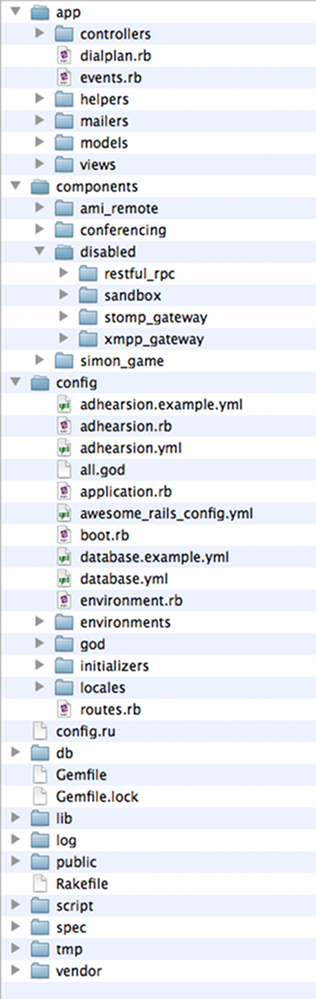

!SLIDE

# Getting Hands On With Adhearsion #

  <ul>
    <li>Ben Klang</li>
    <li>Founder, Mojo Lingo</li>
    <li>bklang@mojolingo.com</li>
    <li>Twitter/Github: @bklang</li>
  </ul>

  <ul>
    <li>Ben Langfeld</li>
    <li>Adhearsion Core Team</li>
    <li>ben@langfeld.me</li>
    <li>Twitter/Github: @benlangfeld</li>
  </ul>

!SLIDE bullets
# What is Adhearsion? #

* Ruby-based framework for telephony applications
* Inspired by Rails, but not dependent
* Adhearsion Democratizes Telephony Development

!SLIDE bullets center
# Design goals #

* Intuitive Domain Specific Language
* Bring Modern Development Practices to Telephony
* Maximize code re-use (even between Cloud and Premise)

!SLIDE center

!SLIDE
    @@@ Ruby
    collection {
      play "welcome"
    
      pin = input 6, :play => "please-enter-your-pin"
    
      this_customer = Customer.find_by_pin(pin)
      if this_customer
        if this_customer.delinquent?
          play "sorry", "you-have-outstanding-debts"
    
          menu "would-you-like-to-make-a-payment", :tries => 3 do |option|
            option.add_credit 1
            option.delinquent 2
    
            option.on_failure do
              play "you-did-not-make-a-valid-selection"
              +customer_service
            end
          end
        else
          +account_admin
        end
      else
        play "we-could-not-find-that-customer-record"
        hangup
      end
    }

!SLIDE center
# Embedding Adhearsion in Rails #

!SLIDE bullets incremental
# Simple example application #

* Everyone loves a spontaneous conference call
* Getting people in is tricky
* Not everyone likes the phone ringing
* Not everyone is available

!SLIDE bullets incremental
# A solution, live #

* Simple rails app for managing contacts
* Select contacts to call
* System ask contacts via Jabber if they are available
* Will read apologies via Jabber into the conference
!SLIDE center
# Questions #

* Website http://adhearsion.com
* Twitter @adhearsion
* Github http://github.com/adhearsion/adhearsion
