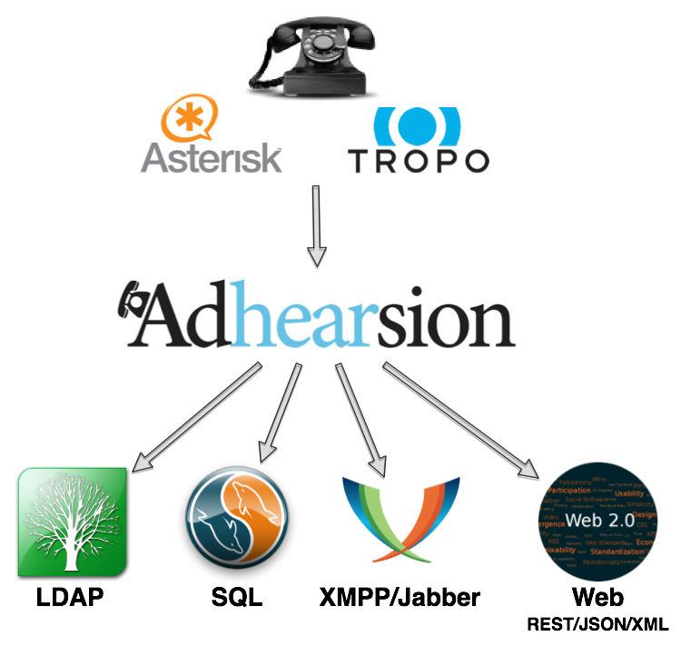

!SLIDE
# Getting Hands On With Adhearsion #
## http://adhearsion.com ##

  <ul>
    <li>Ben Klang</li>
    <li>Founder, Mojo Lingo</li>
    <li>bklang@mojolingo.com</li>
    <li>Twitter/Github: @bklang</li>
  </ul>

  <ul>
    <li>Ben Langfeld</li>
    <li>Super Awesome Description</li>
    <li>ben@langfeld.me</li>
    <li>Twitter/Github: @benlangfeld</li>
  </ul>

!SLIDE bullets incremental
# What is Adhearsion? #

* Ruby-based framework for telephony applications
* Inspired by Rails, but not dependent
* Abstracts away the complexity of the telephony world

!SLIDE center

